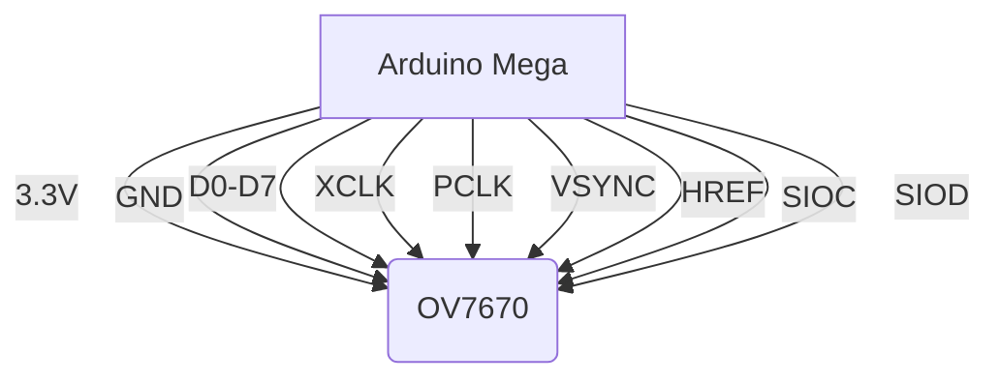
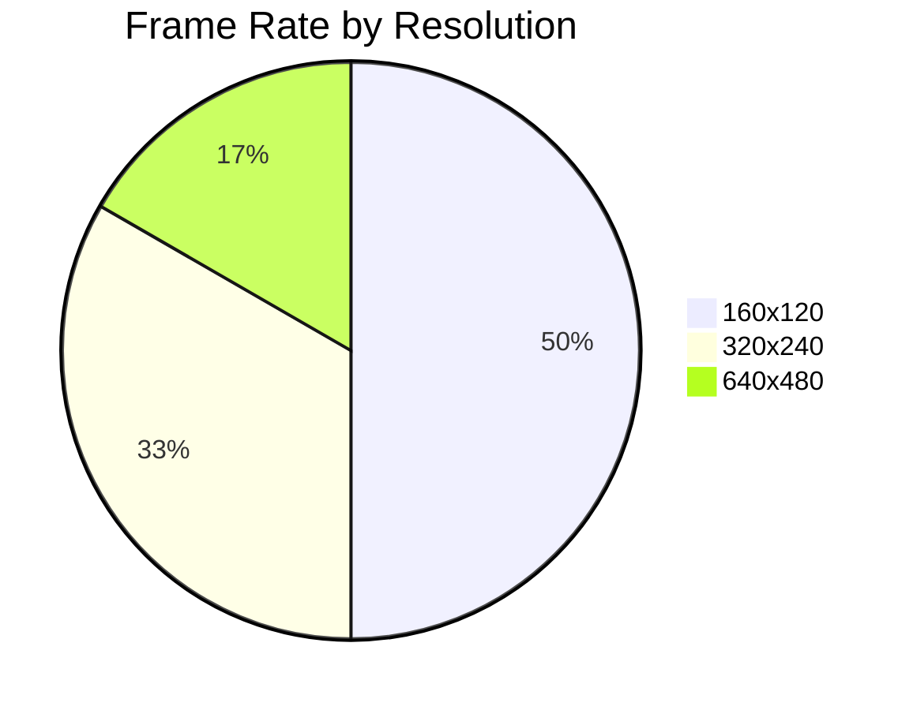

# 📸 Arduino OV7670 Camera Viewer

<div align="center">
  
  <br>
  
  
  
  
</div>

## 🌟 Features

<div align="center">
  <table>
    <tr>
      <td></td>
      <td></td>
      <td></td>
    </tr>
    <tr>
      <td align="center"><b>30FPS Capture</b></td>
      <td align="center"><b>RGB565/YUV422</b></td>
      <td align="center"><b>Computer Vision</b></td>
    </tr>
  </table>
</div>

- **Real-time video** at QVGA (320x240) resolution
- **Multiple color formats** supported
- **On-screen controls** for camera adjustment
- **OpenCV processing pipeline** with filters
- **Cross-platform** compatibility

## 🛠 Hardware Setup



**Component List**:
- Arduino Mega 2560
- OV7670 Camera Module
- 3.3V Voltage Regulator
- 8MHz Crystal Oscillator
- 10kΩ Resistors (x4)
- 0.1µF Capacitors (x10)

## 💻 Software Installation

```bash
# Clone repository
git clone https://github.com/yourusername/arduino-camera-viewer.git
cd arduino-camera-viewer

# Install dependencies
pip install -r requirements.txt  # Python
# OR
mkdir build && cd build && cmake .. && make  # C++
```

## 🎮 Usage

```python
python viewer.py \
    --port COM3 \
    --resolution 320 240 \
    --format RGB565 \
    --fps 30
```

**Keyboard Controls**:
| Key | Function |
|-----|----------|
| `+/-` | Adjust brightness |
| `r` | Reset camera |
| `s` | Save frame |
| `p` | Toggle processing |

## 📊 Performance



## 🖼️ Sample Outputs

<div align="center">
  
  
  
</div>

## 🚀 Quick Start Guide

1. [Download Arduino IDE](https://www.arduino.cc/en/software)
2. Upload `arduino/ov7670_capture.ino`
3. Connect camera as per wiring diagram
4. Run the viewer application:
   ```bash
   python viewer.py --port YOUR_PORT
   ```

## 📜 License

This project is licensed under the MIT License - see the [LICENSE.md](LICENSE.md) file for details.

---

<div align="center">
  
  <br>
  <sub>Built with ❤️ by <a href="https://github.com/yourusername">Your Name</a></sub>
</div>
```
