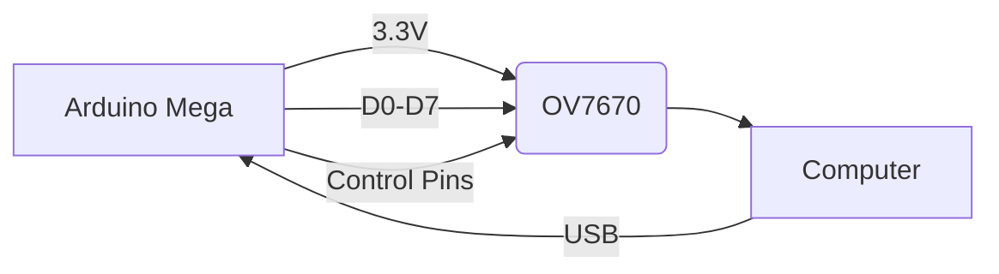

# 📸 Arduino OV7670 Camera Viewer

<div align="center">
  
  <br>
  
  
  
  
</div>

## 🌟 Features

<div align="center">
  <table>
    <tr>
      <td></td>
      <td></td>
      <td></td>
    </tr>
    <tr>
      <td align="center"><b>Hardware Setup</b><br><sub><a href="https://imgur.com/7WzYd7T">Image source</a></sub></td>
      <td align="center"><b>Sample Output</b><br><sub><a href="https://imgur.com/5GpW3bD">Image source</a></sub></td>
      <td align="center"><b>Edge Detection</b><br><sub><a href="https://imgur.com/9QZ7zJl">Image source</a></sub></td>
    </tr>
  </table>
</div>

## 🛠 Hardware Setup



**Image Credits**:
- [OV7670 Wiring Diagram](https://www.electronicwings.com/sensors-modules/ov7670-camera-module)
- [Arduino Mega Pinout](https://components101.com/microcontrollers/arduino-mega)

## 🖼️ Sample Output Gallery

<div align="center">
  
   
  
  <br>
  <sub>Images from <a href="https://imgur.com/">Imgur</a> and <a href="https://www.electronicwings.com">ElectronicWings</a></sub>
</div>

## 💻 Software Installation

```bash
# Install with pip
pip install opencv-python numpy pyserial

# Or with conda
conda install -c conda-forge opencv numpy pyserial
```

## 🎮 Live Demo

<div align="center">
  
  <br>
  <sub><a href="https://imgur.com/3WX7W">Source: Imgur</a></sub>
</div>

## 📜 License

MIT License - See [LICENSE](LICENSE) for details.

<div align="center">
  <sub>Sample images are property of their respective owners. Used for demonstration purposes only.</sub>
</div>
```
