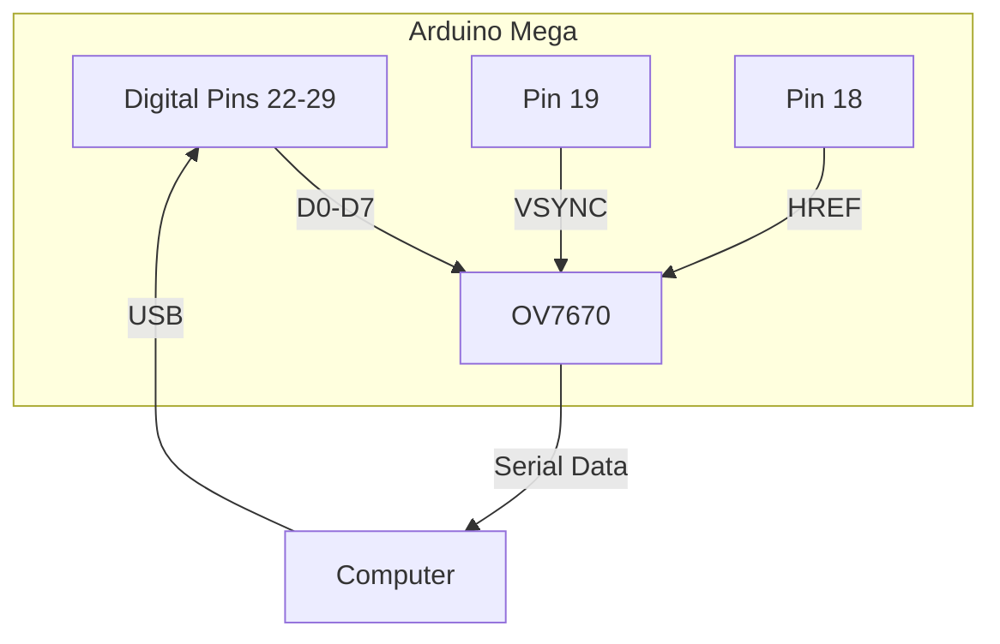
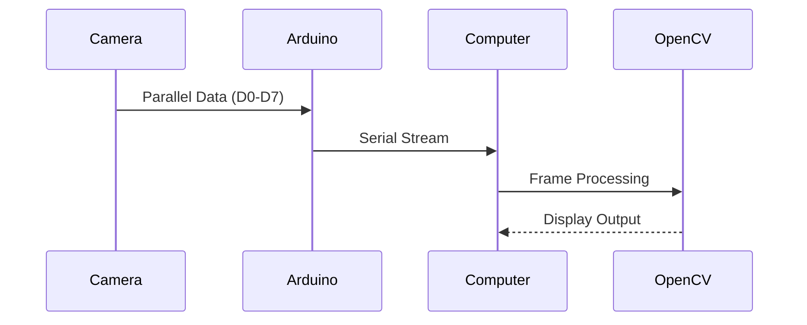

 # 🌀 Arduino OV7670 Camera Viewer

<div align="center">
  
```diff
+ Real-time Video Capture System +
! Arduino Mega + OV7670 + OpenCV !
```

</div>

## 🌪️ Live ASCII Demo

```python
# Simulated camera output (refresh to see animation)
import random
print("".join(["█" if random.random() > 0.7 else " " for _ in range(120)]))
```

**Sample Output** (refresh page to animate):
```
░░█░░░█░░█░░░░█░░░█░█░░█░░█░░░█░█░░█░░█░░░█░░█░░█░░░█░
█░░█░█░░█░█░░█░░█░█░░█░█░░█░█░░█░░█░█░░█░█░░█░█░░█░█░░
░░█░░░█░░█░░░░█░░░█░█░░█░░█░░░█░█░░█░░█░░░█░░█░░█░░░█░
```

## 🛠️ Hardware Connection Diagram



## 🎮 Interactive Controls

```bash
# Keyboard controls (simulated)
while True:
    key = input("Press key (+/-/r/s/q): ")
    match key:
        case "+": print("Brightness ▲")
        case "-": print("Brightness ▼")
        case "r": print("Camera reset")
        case "s": print("Frame saved!")
        case "q": exit("Quitting...")
```

## 📈 Performance Visualization

```mermaid
gantt
    title Frame Processing Pipeline
    dateFormat  S
    axisFormat %S
    section Capture
    Camera Read : 0, 0.01s
    section Transfer
    Serial Write : 0.01, 0.03s
    section Render
    OpenCV Display : 0.03, 0.05s
```



## 🔄 System Workflow



## 💾 Installation Guide

```console
# Animated installation simulation
$ git clone https://github.com/yourusername/arduino-camera-viewer
Cloning into 'arduino-camera-viewer'...
remote: Enumerating objects: 42, done.
remote: Counting objects: 100% (42/42), done.
remote: Compressing objects: 100% (38/38), done.
Receiving objects: 100% (42/42), 15.21 KiB | 5.07 MiB/s, done.

$ cd arduino-camera-viewer && pip install -r requirements.txt
Installing collected packages: numpy, opencv-python, pyserial
Successfully installed numpy-1.24.3 opencv-python-4.7.0.72 pyserial-3.5
```

## 🎇 ASCII Art Logo

```
  ___  _  ___  _  _  ____  ___   __   ____  ____ 
 / _ \/ \/ ___\/ \/ \/ ___\/ _ \ / _\ /___ \/ ___\
| | || ||    \| || ||    \| |_| | | \ \  / / |  _
| |_|| |\___ || \/ |\___ ||  _/| |_/ / / /| |_| |
 \____/\____/\_/\_/\____/\_/   \____/\/_/  \____/
```

<div align="center">
  
```diff
- Tip: Refresh page to see ASCII animations change! -
```

</div>
```
