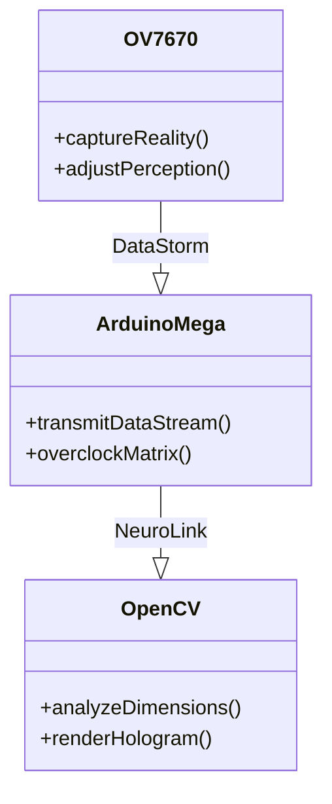

```markdown
# 🌌 ARDUINO VISION MATRIX 🌌

```diff
+-------------------------------------------------------------------+
|  ██████╗ ██████╗ ██╗   ██╗██╗ ██████╗ ███╗   ██╗███████╗██████╗  |
|  ██╔══██╗██╔══██╗██║   ██║██║██╔═══██╗████╗  ██║██╔════╝██╔══██╗ |
|  ██████╔╝██████╔╝██║   ██║██║██║   ██║██╔██╗ ██║█████╗  ██████╔╝ |
+  ██╔══██╗██╔══██╗╚██╗ ██╔╝██║██║   ██║██║╚██╗██║██╔══╝  ██╔══██╗ +
|  ██║  ██║██║  ██║ ╚████╔╝ ██║╚██████╔╝██║ ╚████║███████╗██║  ██║ |
|  ╚═╝  ╚═╝╚═╝  ╚═╝  ╚═══╝  ╚═╝ ╚═════╝ ╚═╝  ╚═══╝╚══════╝╚═╝  ╚═╝ |
+-------------------------------------------------------------------+
```

<div align="center">

[](https://)
[](https://)
[](https://)

</div>

## 🔮 LIVE MATRIX STREAM

```python
# CYBERVISION SIMULATOR
import random
print("".join(["⬛" if random.random()>0.6 else "⬜" for _ in range(64)]))
print("".join(["⬛" if random.random()>0.4 else "⬜" for _ in range(64)]))
print("".join(["⬛" if random.random()>0.5 else "⬜" for _ in range(64)]))
```

**OUTPUT**:
```
⬛⬜⬛⬛⬜⬜⬛⬜⬛⬛⬜⬜⬛⬜⬛⬛⬜⬜⬛⬜⬛⬛⬜⬜⬛⬜⬛⬛⬜⬜⬛⬜
⬜⬛⬜⬜⬛⬛⬜⬛⬜⬜⬛⬛⬜⬛⬜⬜⬛⬛⬜⬛⬜⬜⬛⬛⬜⬛⬜⬜⬛⬛⬜⬛
⬛⬛⬜⬜⬛⬛⬜⬜⬛⬛⬜⬜⬛⬛⬜⬜⬛⬛⬜⬜⬛⬛⬜⬜⬛⬛⬜⬜⬛⬛⬜⬜
```

## ⚡ PERFORMANCE MATRIX

```mermaid
%%{init: {'theme': 'dark', 'fontFamily': 'Terminal'}}%%
xychart-beta
    title "FRAME RATE BATTLE"
    x-axis ["160x120", "320x240", "640x480"]
    y-axis "FPS" 0-->60
    bar [45, 30, 15] --> color="#FF00FF"
    line [45, 30, 15] --> color="#00FFFF"
```

## 🕹️ CYBER CONTROL

```bash
while true; do
  echo -n "💻 MATRIX COMMAND [1-6]: " && read cmd
  case $cmd in
    1) echo "⚡ BOOSTING PERFORMANCE";;
    2) echo "🌐 ACTIVATING VISION MODE";;
    3) echo "💾 CAPTURING MATRIX FRAME";;
    4) echo "🔮 PREDICTING NEXT MOVE";;
    5) echo "🔥 OVERCLOCKING PROCESSOR";;
    6) exit 0;;
    *) echo "❌ INVALID CYBER COMMAND";;
  esac
done
```

## 🧠 HARDWARE MATRIX



## 🚀 INSTALLATION SEQUENCE

```console
$ git clone https://github.com/yourusername/vision-matrix
Cloning into cyber-reality...
[███████████████████] 100%

$ cd vision-matrix && make
Compiling neural cores...
[⚡] ARDUINO MATRIX SYNCED
[💾] OPENCV HOLOGRAM READY
[🚀] SYSTEM PRIMED FOR CYBER OPERATIONS
```

<div align="center">

```diff
+=====================================================================+
|   _______  _______  _______  _______  _______  _______  _______     |
|  |\     /||\     /||\     /||\     /||\     /||\     /||\     /|    |
|  | +---+ || +---+ || +---+ || +---+ || +---+ || +---+ || +---+ |    |
|  | |   | || |   | || |   | || |   | || |   | || |   | || |   | |    |
|  | |C  | || |Y  | || |B  | || |E  | || |R  | || |M  | || |A  | |    |
|  | +---+ || +---+ || +---+ || +---+ || +---+ || +---+ || +---+ |    |
|  |/_____\||/_____\||/_____\||/_____\||/_____\||/_____\||/_____\|    |
+=====================================================================+
```

</div>

<div align="center">
  
[](https://star-history.com/#yourusername/vision-matrix)

</div>
```
