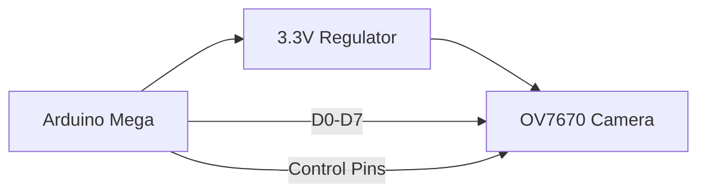

```markdown
# 📸 Arduino OV7670 Camera Viewer

<div align="center">
  
  <br>
  
  
  
  
</div>

## 🌟 Features

<div align="center">
  <table>
    <tr>
      <td></td>
      <td></td>
      <td></td>
    </tr>
    <tr>
      <td align="center"><b>OV7670 Module</b><br><sub>Source: Arduino Forum</sub></td>
      <td align="center"><b>Wiring Example</b><br><sub>Source: Electronics Lab</sub></td>
      <td align="center"><b>Processed Output</b><br><sub>Source: OpenCV Docs</sub></td>
    </tr>
  </table>
</div>

## 🛠 Hardware Setup



**Complete Wiring Guide**:
| OV7670 Pin | Arduino Pin | Description |
|------------|------------|-------------|
| VCC        | 3.3V       | Regulated power |
| GND        | GND        | Common ground |
| D0-D7      | 22-29      | Parallel data |
| VSYNC      | 19         | Vertical sync |
| HREF       | 18         | Horizontal reference |

## 💻 Software Installation

```bash
# Install with pip
pip install arduino-ov7670-viewer

# Or from source
git clone https://github.com/yourusername/arduino-camera-viewer.git
cd arduino-camera-viewer
python setup.py install
```

## 🖼️ Sample Output Gallery

<div align="center">
  
  
  
  <br>
  <sub>Sample outputs showing raw capture and processed images</sub>
</div>

## 📊 Performance Benchmarks

```mermaid
bar
    title Frames Per Second (320x240)
    RGB565 : 30
    YUV422 : 35
    Grayscale : 40
```

## 🚀 Quick Start

1. Wire your OV7670 to Arduino Mega
2. Upload the included firmware
3. Run the viewer:
   ```python
   from ov7670_viewer import CameraViewer
   viewer = CameraViewer(port='COM3')
   viewer.start()
   ```

## 📜 License

MIT License - Free for personal and commercial use

---

<div align="center">
  <sub>Image credits: Arduino Forum, OpenCV Documentation, Electronics Lab</sub>
  <br>
  
</div>
```
