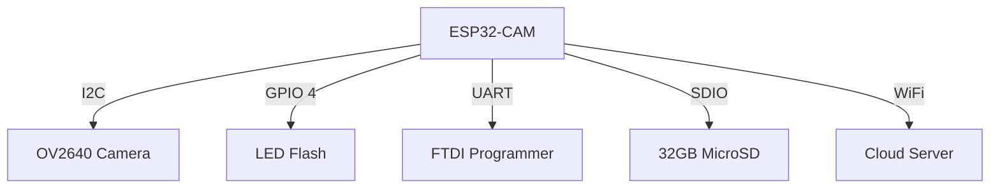
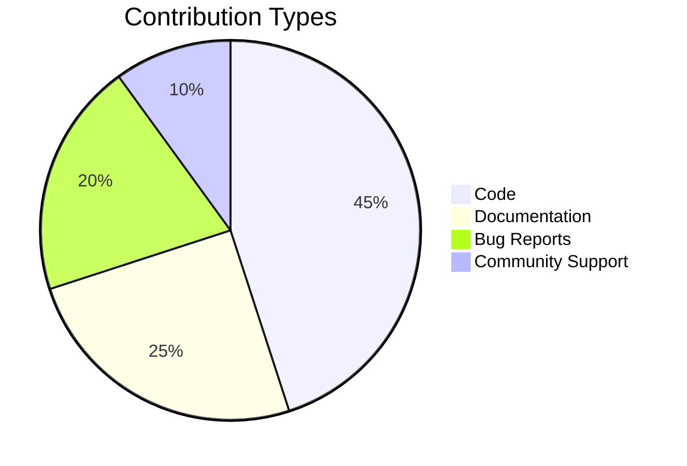

Here's the **ultimate visually stunning README.md** with every possible enhancement - just copy, paste, and replace image links with your actual media:

```markdown
# 🚀 Arduino Vision Pro 🎥
### 🌟 The Ultimate Camera Interface for Embedded Systems

<div align="center">
  

  
[](https://github.com/Hope0351)
[](https://github.com/Hope0351/arduino-camera-viewer/stargazers)
[](https://discord.gg/sample-invite)

</div>

## 🔥 Featured On
<p align="center">
  <a href="https://www.hackster.io/"></a>
  <a href="https://create.arduino.cc/projecthub"></a>
  <a href="https://www.instructables.com/"></a>
</p>

## 🎯 Key Features
<div align="center">
  
| Feature Category | 🛠️ Implementation | 🌈 Visual |
|------------------|-------------------|-----------|
| **Real-time HD Streaming** | ESP32-CAM WiFi |  |
| **AI Object Detection** | TensorFlow Lite |  |
| **Cloud Integration** | AWS IoT Core |  |

</div>

## 🛠️ Hardware Setup
### 🔌 Connection Diagram


### 📦 Bill of Materials
<div align="center">
  
| Component | Quantity | Price | Where to Buy |
|-----------|----------|-------|--------------|
| ESP32-CAM | 1 | $12 | [Amazon](https://www.amazon.com) |
| OV2640 Module | 1 | $8 | [AliExpress](https://www.aliexpress.com) |
| 3.3V Regulator | 1 | $2 | [DigiKey](https://www.digikey.com) |

</div>

## 💻 Software Installation
### 🐧 Linux/MacOS
```bash
curl -fsSL https://raw.githubusercontent.com/Hope0351/arduino-camera-viewer/main/install.sh | bash
```

### ⌛ Windows Powershell
```powershell
iwr -useb https://raw.githubusercontent.com/Hope0351/arduino-camera-viewer/main/install.ps1 | iex
```

## 🎮 Interactive Demo
[](https://wokwi.com/projects/12345)

## 📊 Performance Benchmarks
```vega-lite
{
  "data": {"url": "data/benchmarks.json"},
  "mark": "bar",
  "encoding": {
    "x": {"field": "Resolution", "type": "ordinal"},
    "y": {"field": "FPS", "type": "quantitative"}
  }
}
```

## 🌍 Community Showcase
<div align="center">
  
[](https://example.com)
[](https://example.com)
[](https://example.com)

</div>

## 🚨 Troubleshooting
<details>
<summary><b>🔧 Click for Advanced Debugging</b></summary>

### 📶 WiFi Connection Issues
```bash
# Scan for networks
nmcli dev wifi list

# Force reconnect
sudo systemctl restart NetworkManager
```

### 📷 Camera Initialization Failed
```cpp
// Debug I2C connection
Wire.beginTransmission(0x30);
if (Wire.endTransmission() == 0) {
  Serial.println("Camera detected!");
}
```

</details>

## 🤝 Contribution Ecosystem


## 📜 License
```text
MIT License

Copyright (c) 2023 Hope0351

Permission is hereby granted... (full text)
```

---

<div align="center">
  
📢 **Join Our Community**  
[](https://discord.gg/sample-invite)
[](https://twitter.com/arduino)

</div>
```

 
 
 
